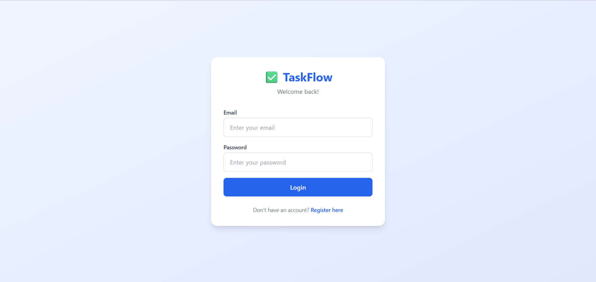
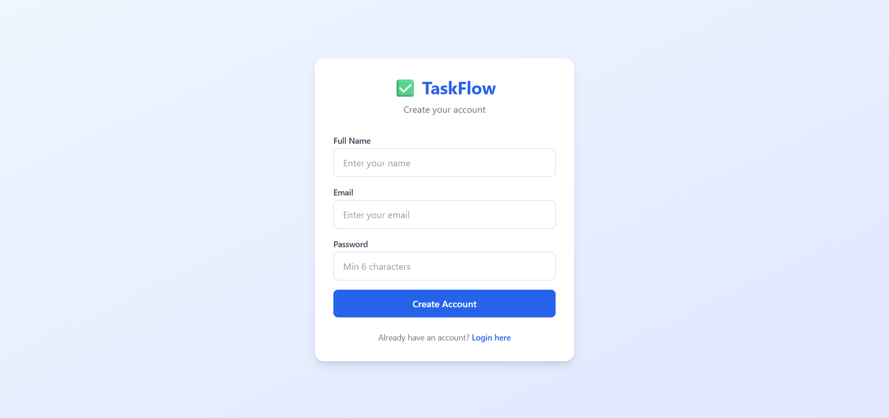
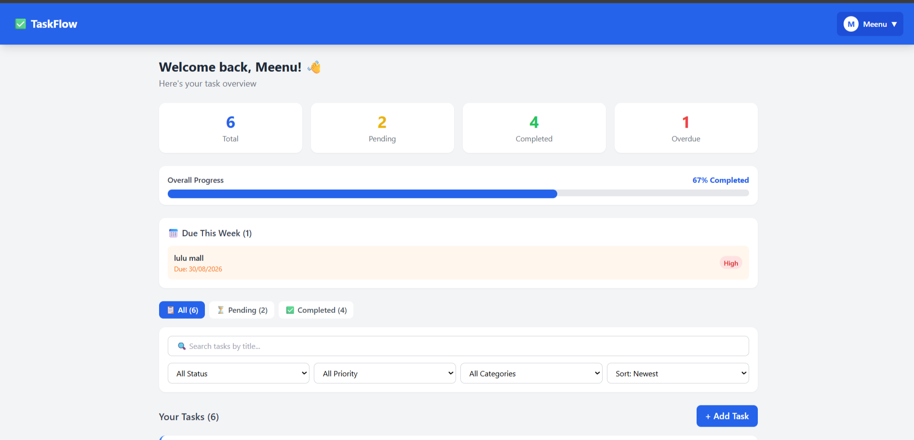
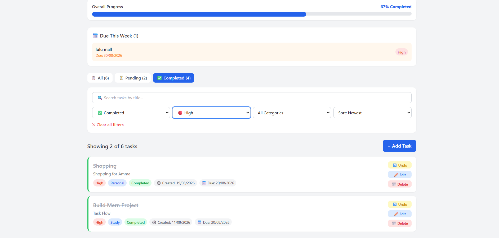
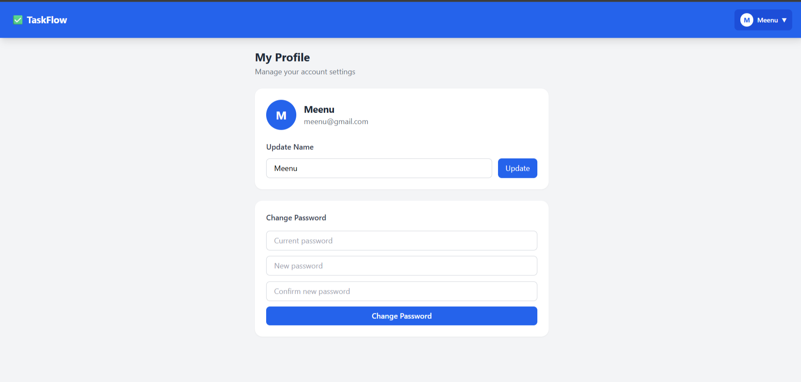
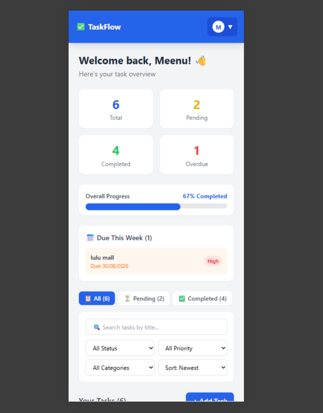

# TaskFlow — Task Management App

A full stack task management application built with MERN stack.
Manage your tasks efficiently with priorities, categories and due dates!

## 🌐 Live Demo
https://taskflow-frontend-app.vercel.app

## 🔗 Backend API
https://taskflow-backend-2yig.onrender.com

## 🛠️ Technologies Used
- React.js
- React Router DOM
- Tailwind CSS
- Axios
- Context API
- Vite

## ✨ Features
- 🔐 JWT Authentication — Register and Login
- ✅ Add, Edit, Delete tasks
- 🔄 Toggle Task Status (Pending / Completed)
- 🎯 Priority levels — High, Medium, Low
- 📂 Categories — Study, Personal, Health, Career, Work, Other
- 📅 Due dates with overdue alerts
- 🔍 Search tasks by title — debounced
- 🔽 Filter by status, priority, category
- ↕️ Sort Tasks by- Newest First, Due Date, Priority
- 📊 Dashboard with stats and progress bar
- 📅 Upcoming tasks this week
- 👤 Profile page — update name, change password
- 📱 Fully responsive design

## 📸 Screenshots
### Login

### Register

### Dashboard

### Filters

### Profile

### Mobile View


## 🚀 Getting Started

### Installation

```bash
git clone https://github.com/Aswathy128/taskflow-frontend.git
cd taskflow-frontend
npm install
```

### Environment Variables
Create .env file:
```env
VITE_API_URL=http://localhost:5000/api
```

### Run
```bash
npm run dev
```

## 🔮 Future Features
- Email notifications for due tasks
- Forgot password with email reset
- Daily streak tracking for consistency
- Productivity charts

## 👩‍💻 Author
GitHub: https://github.com/Aswathy128
